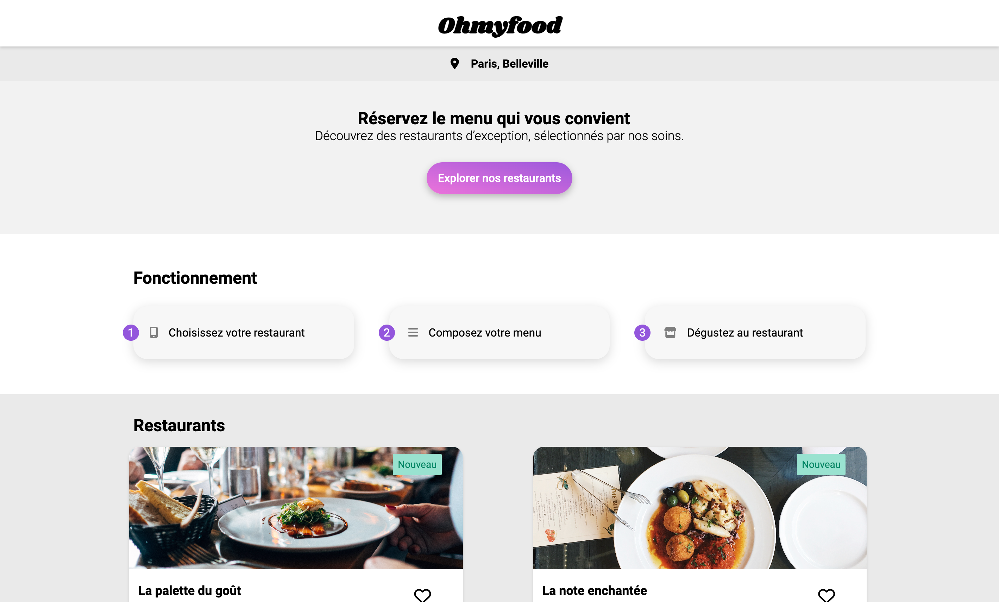

# 

Projet réalisé dans le cadre de la formation Développeur Web avec OpenClassrooms

## 🧐 Contexte (fictif)

Développer un site “mobile first” qui répertorie les menus de restaurants gastronomiques.

En plus des systèmes classiques de réservation, les clients pourront composer le menu de leur repas pour que les plats soient prêts à leur arrivée.

## 🚀 Objectifs

- Intégrer le site en HTML, CSS et Sass avec la [maquette](https://www.figma.com/file/t4449fzDnwGYmzuwQdu87V/Projet-3-FR---Ohmyfood?node-id=0%3A1) fournie et en respectant les spécifications du [brief créatif](https://course.oc-static.com/projects/D%C3%A9veloppeur+Web/IW_P4+Animations+CSS+Ohmyfood/Brief+cr%C3%A9atif+site+Ohmyfood.pdf).
- Le site doit être responsive, développé en mobile first.
- Des effets d'animations doivent êtres créees pour :
    - le loader du site
    - les boutons (boutons pricipaux et like)
    - l'apparition des plats à l'arrivée sur les pages menus
    - l'ajout d'un plat au panier (avec une coche à droite du plat, au survol pour cette première version).
- Le code HTML ne doit pas contenir de propriété CSS.
- L'utilisation de Sass n'est pas obligatoire mais recommandé.
- Les codes HTML et CSS ne doivent soulever aucune erreur sur le validateur W3C.
- Aucun autre langage ne doit être utilisé (comme JavaScript, par exemple).

## 🛠️ Technologies

## 🏆 Résultat

➡️  [Visiter le site](https://halaiks.github.io/OC-P3-Ohmyfood/)

## 🙇 Auteur

#### Alexandre GUILLAUME

- Site web : [Alexandre-Guillaume.fr](https://alexandre-guillaume.fr)
- LinkedIn : [Alexandre GUILLAUME](https://www.linkedin.com/in/alexguillaume94/)
- Github : [@Halaiks](https://github.com/Halaiks)
